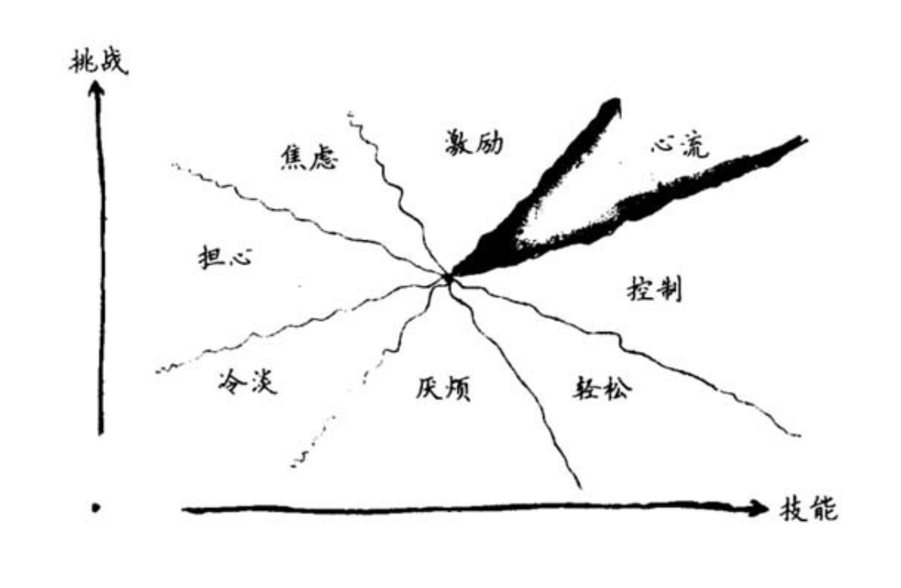
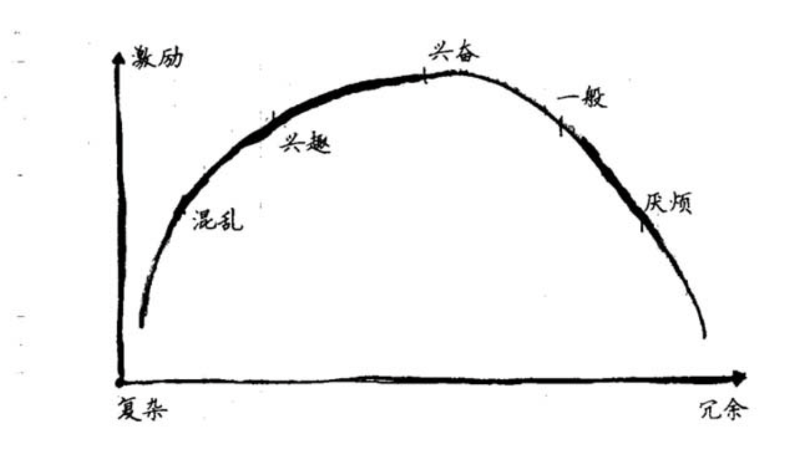
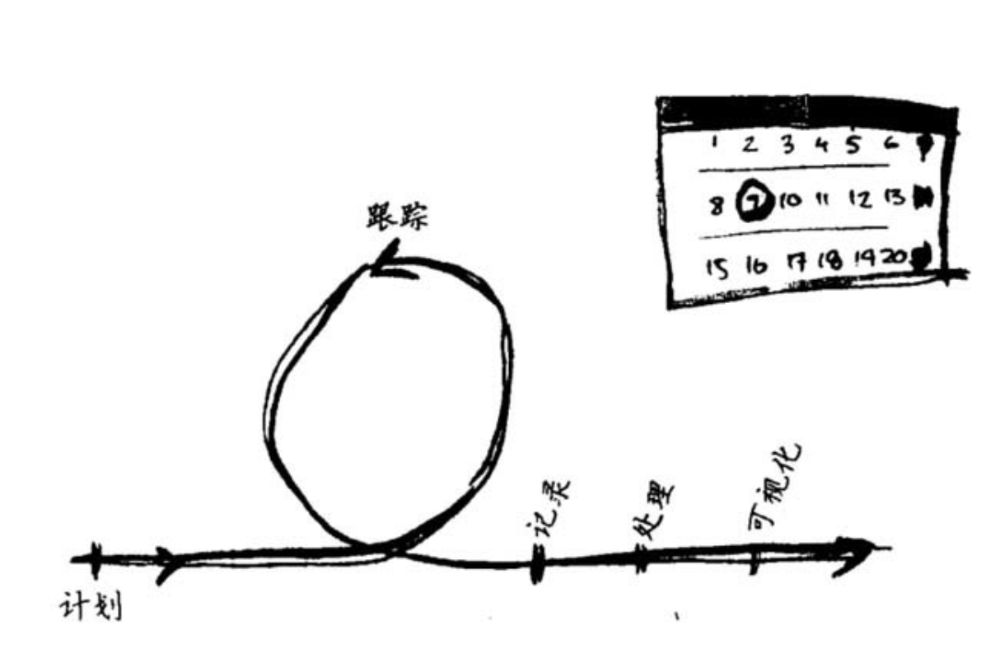
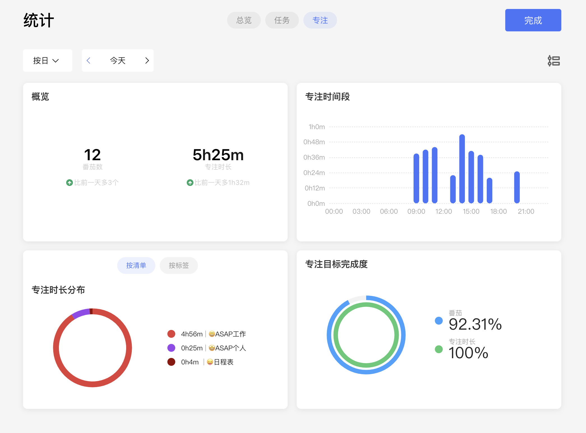
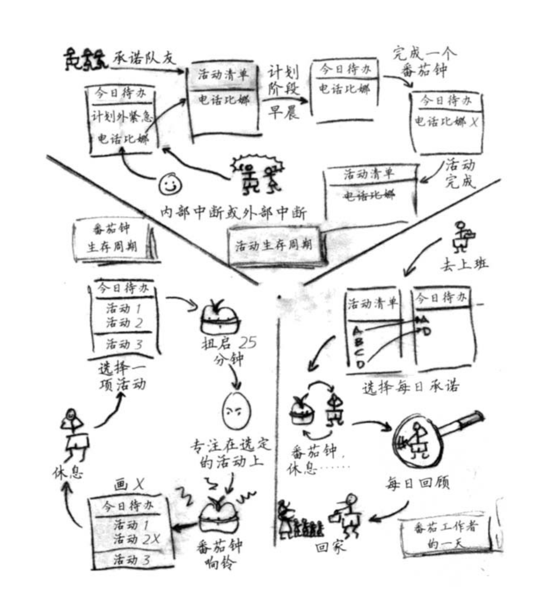

最近阅读了《番茄工作法图解》一书，结合自己的实践经验和个人理解，写一篇总结。番茄工作法的核心思路是：

> 一个番茄，一个活动，一个目标。

### 哪些人需要番茄工作法  

- 面对复杂的问题，倾向于拖延。拖延获得一时的清净，但是问题并不会消失
- 面对无聊或难度低的事，没有干劲
- 被各种小事拖累，经常一天下来，一件大事都没做成
- Deadline逼近的时候，手忙脚乱，往往无法专心投入工作
- 休息过后，不能迅速把之前的状态捡起来
- 事情多时，各种各样的事情占据大脑，无法专心于一件事
- 完美主义，总觉得还有更好的方案。这其实也是另一种形式的拖延

**有以上问题的人，都可以试试番茄工作法。**  

### 从科学的角度看为什么番茄有用  

- 人的每一个器官以及人体本身都有节律性。而番茄工作法正是一个个25min+5min的循环，这种有规律有节奏的工作方式非常适合大脑。  

- 所有哺乳动物都有条件反射，而条件反射是可以培养的。时间久了，番茄工作法开启25min时钟的动作，可以与立即集中精力培养成条件反射。

- 人在疲惫时往往很难集中注意力，所以996增加了工作时间，但可能导致效率下降。而番茄工作法没个番茄钟休息5min，有利于可持续发展。

- 大脑的工作记忆区很小，其容量有限，不能分心处理两件事。

- 人在睡眠、发呆、休息等**“待机状态时”**，大脑并不是出于完全空闲状态。它会融会贯通之前学到的知识，并产生新的思路。所以经常会遇到吃饭或者洗澡时，突然想通一个问题的情况。番茄钟休息的5min正是用来让大脑吸收之前的25min的内容。

- 任务的复杂度与人所获得的激励的关系如下面两图所示，所以才会出现挑战过大或过小，任务过难或过于简单时，都无法达到最佳状态，这也是《心流》一书中提到的一个观点。而番茄工作法25min中内只需要关注这25min需要处理的工作，既没有巅峰，也没有低估，是一种可持续的步伐。

  

  

### 具体实施方法  

本节将介绍番茄工作法的具体内容和流程。

#### 工具  

番茄工作法希望工具尽可能的简单，消除任何可以让工作者拖延的理由。所以它的工具是三张表格一只笔，三张表格分别是：

- 任务清单：记录所有接下来要做的任务，尽量言简意赅，自己可以读懂即可。如果有deadline的话，可以同时记录上。
- 今日待办：每天早上从任务清单中量力而行的选取几个任务加入到今日待办中，可以根据任务的优先级和重要程度来选取。今日待办是自己做出的承诺，当一天结束并完成承诺时，满心欣慰。
- 记录：对这一整天使用番茄工作法时的状态做记录。比如当一个番茄钟完成时，记录一个X，当番茄钟过程中发生中断时，记录一个撇号。每天结束时可以分析数据，思考改进思路。

#### 阶段  

如上图所示即为番茄工作法的五个阶段：

- 计划：每天的开始做出承诺，写到今日待办
- 跟踪：不断重复的25min工作和5min休息的循环
- 记录：完成一个番茄钟记X，内部中断记撇号，外部中断记减号
- 处理：从记录中提取有用的信息：比如
  - 每日完成的番茄钟总数
  - 被打断的次数及内部中断通常位于第多少分钟
  - 预估的番茄钟与实际的番茄钟数
  - 计划时所写的任务与一天完成时实际完成的任务
- 可视化：每天结束时，分析数据，找出改进思路，精益求精。

这个流程有一点复杂，刚开始使用时，可以只记录完成的番茄钟个数。

#### 关于跟踪阶段  

跟踪阶段本身又可以细化为四个小阶段

- 番茄钟启动时：每个番茄钟开始前，选择此刻你认为最重要的事情。这样可以避免大事现行、后进先出这两个人们通常会犯的错误。
- 番茄钟进行时：此时你选取了一个任务，就只需要集中精力在这一个事情上。如果任务提前完成，尽量不要提前结束任务，可以进行“过度学习”，即对已完成的任务重新审视，往往可以发现新的内容；更不要去休息，前面我们讲到了要注意节奏，这是大脑的正确运作方式。
- 番茄钟结束时：能够得到直接的激励反馈。
- 休息时：远离任何挑战智力的活动
  - 提倡做：
    - 小咪一会儿，如果不会因此被领导看到而谈话的话
    - 溜达一会儿
    - 看着窗外发呆
    - 接水喝水、上厕所
  - 不建议做：
    - 阅读电子邮件
    - 浏览摸鱼社交网站
    - 打电话

#### 尊重行程  

原书把跟踪阶段的状态归纳为三个帽子，尊重整个阶段的行程非常重要。

- 战略帽：番茄钟即将开始时，换上战略帽，选取此刻最为重要的任务
- 工作帽：番茄钟开始后，只专心于自己选取的这个任务，其他所有的事情都抛诸脑后
- 休闲帽：休息时就放下一切，不做任何会对自己和大脑造成压力的事情。

### 如何处理中断  

番茄钟期间难免会遇到一些意外情况导致中断产生，中断产生时应该如何处理呢？我们把中断分为内部中断和外部中断。

#### 内部中断  

内部中断是指由于个人原因导致的中断，比如突然要上厕所或者突然想到要给某人打个电话等。我们把这类中断分两种情况来处理：

- 无法推迟的事：比如要上厕所，对于这种情况，我们只能终止当前任务，而且不能在记录中添加X，而且回来后，也不能再继续之前未完成的番茄钟，我们可以选择性是否需要休息2-3min，然后开启新的番茄钟
- 可以推迟的事：记录一个撇号，把这件事情记录到“今日待办”或者“活动清单”中，继续完成当前番茄钟，待下一个番茄钟时，评估是否需要立即处理刚才记录的任务。

#### 外部中断  

外部中断是指由于外因导致的中断，比如领导要找你问话或者同事请教问题。同样分两类来处理：

- 通过一定的策略可以推迟的事：比如收到一封电子邮件，通常会发电子邮件给你的人，也不会期望1分钟内就得到回复；再比如同事找你请教一个问题。这类事情，都可以尝试协商推迟，然后记录在“今日待办”中，继续完成当前番茄钟
- 无法推迟的事：比如老板找你问话；或者同事告知你的一次代码提交导致整个系统crash了，这种只能终止当前任务。

### 如何合理预估  

每天开始阶段做出的计划，是你一天的承诺，有以下原则要遵循：

- 选择重要的事情加入  
- 所有事情的预估番茄数之和不要大于今日可以坚持的总番茄数  
- 单个任务的番茄数超过7个，则需要拆分为更小的任务；因为越简单的任务，越能是的预估与实际耗时更接近  
- 不足一个番茄的任务记0，然后最后时与其他同为0的任务合并为一个任务  
- 充分利用历史数据：刚开始可能总是预估的任务过多或过少，但是根据自己的记录，每天做好总结 

### 精益 

通过处理和可视化阶段，找到自己的问题所在，希望明天不要再犯同样的错误，做到精益求精。

- 如果记录时发现自己记录的内部中断非常多，总是无法坚持25min的注意力，那么可以考虑降低专注时长，相应的也要适当降低休息时长。但是，尽量两周内不要改动，而且切忌频繁改动专注时间，这样会使得几天内的数据无法对比
- 如果发现每天预估时计划的任务与一天结束时的任务出入非常大，那么说明预估的方法有待改进，或者总是有新的问题出现。找到根因并精进自己的预估策略。不然每天结束时，无法获得承诺被完成的使命感。
- 如果有一些活动清单的任务长达十几天都没有得到处理，那么考虑删除它。活动清单既不宜过长，也不宜过短，过多的任务会扰乱军心。过少的任务无法产生足够的压力。

### 灵活应变  

在初次使用番茄钟工作法时，尽量不要篡改其基本原则，但是有一些事情可以灵活处理：

- 可以把与同事讨论问题，或者被老板叫去问话等活动不看做是外部中断，结束后继续之前的番茄钟，职场难免需要交流。

- 开会前、午饭前恰好只剩下了30分钟或40分钟，可以把它作为一个番茄钟处理，不然如何处理都很尴尬。

- 可以使用电脑软件代替三个清单一只笔，我目前用下来比较好用的软件有以下两款，后续可能会写一篇文章专门分享他们：

  - [滴答清单](https://dida365.com):这款软件的优点是支持MAC、Windows、浏览器、IOS、Android等平台，功能也非常多。有付费和免费两个版本，免费版本已经够用。而且还可以统计自己的番茄钟情况，附图是我最近完成的情况。缺点是无法记录内部中断外部中断，没有记录任务预计需要的番茄数的位置，我都是在每个任务的备注中记录，也可以用。

  

  - [XorTime](https://www.xoring.com/):这是一款免费的软件，优点是它是完全按照番茄工作法设计的，可以预估番茄数、可以记录内部中断、外部中断；缺点是只有windows版本，而且有时候数据会丢失。

### 流程图  

最后附上番茄工作法的流程图：

### Reference  

- 《番茄工作法图解》